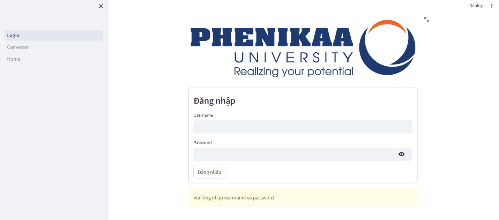
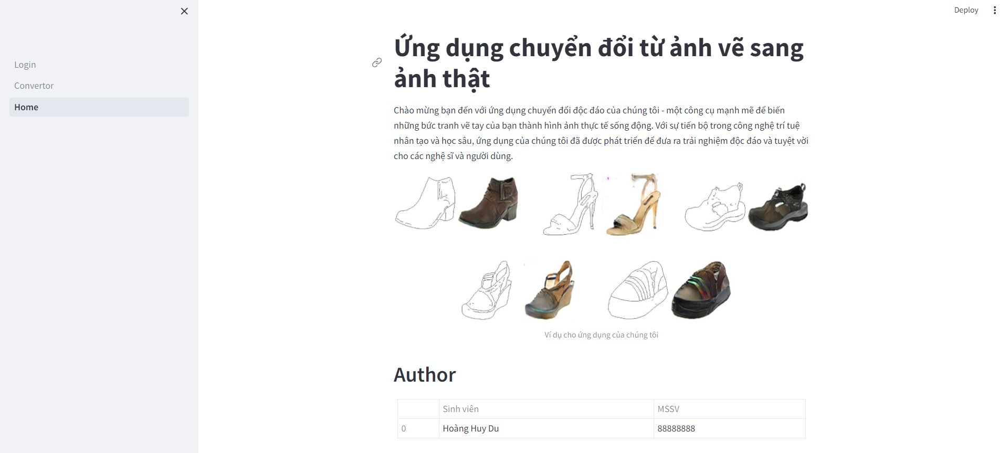
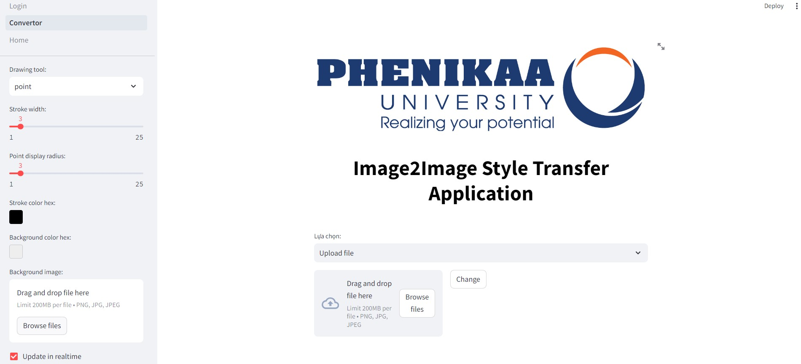
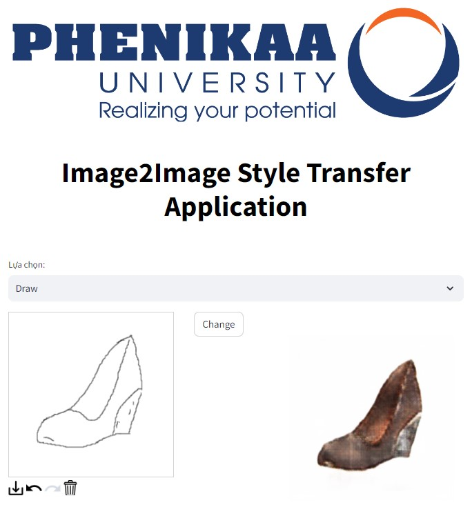
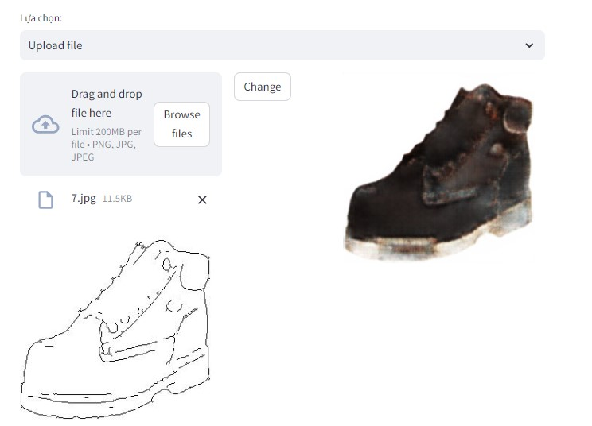

# Ứng dụng Image-to-Image Style Transfer sử dụng Pix2Pix GAN

Đề tài đồ án liên ngành xây dựng một ứng dụng Image-to-Image Style Transfer sử dụng mô hình Pix2Pix GAN.

## Mục đích
- Xây dựng một ứng dụng có khả năng chuyển đổi ảnh từ đen trắng sang màu sử dụng mô hình Pix2Pix GAN.
- Phát triển giao diện người dùng thân thiện để người dùng có thể tải lên hoặc vẽ ảnh đen trắng và xem kết quả chuyển đổi.

## Giao diện và chức năng
### Giao diện chính
   

### Giao diện chức năng
* Chức năng vẽ ảnh -  * Chức năng tải ảnh - 
  

  
## Cách sử dụng
1. **Clone dự án:**
    ```
    git clone https://github.com/huydu67/ImageStyleTransfer-using-GAN-based.git
    cd ImageStyleTransfer-using-GAN-based
    ```

2. **Cài đặt các thư viện:**
    ```
    pip install -r requirements.txt
    ```
3. **Tải trọng số mô hình:**
    Vì kích thước lớn của trọng số mô hình nên em đã lưu chúng trên Google Drive. Bạn có thể tải trọng số mô hình từ Google Drive và đặt chúng trong thư mục `models/` của dự án.

    - [Trọng số Generator network](https://drive.google.com/file/d/1wFPAjRY-WgQKj4XGHbIaBF4USSQkPleu/view?usp=sharing) - Trọng số của mạng Generator đã được huấn luyện.
    - [Trọng số Discriminator network](https://drive.google.com/file/d/1JsD9Z7jfh3UXSf2WFeAUjw8Co90EZ7Vj/view?usp=sharing) - Trọng số của mạng Discriminator đã được huấn luyện.

    Sau khi tải trọng số mô hình, hãy đặt chúng trong thư mục `models/` của dự án trước khi chạy ứng dụng.


4. **Chạy ứng dụng:**
    ```
    streamlit run app.py
    ```

5. **Mở trình duyệt và truy cập vào URL:**
    ```
    http://localhost:8501
    ```

6. **Tải lên hoặc vẽ ảnh đen trắng và xem kết quả chuyển đổi.**

## Cấu trúc dự án
- **Login.py:** File chính của ứng dụng, chứa mã nguồn cho giao diện người dùng và xử lý logic.
- **models/:** Thư mục chứa mô hình Pix2Pix GAN và các tập dữ liệu.
- **requirements.txt:** File chứa danh sách các thư viện cần thiết để chạy dự án.

## Tài liệu tham khảo
- [Pix2Pix: Image-to-Image Translation with Conditional Adversarial Networks](https://arxiv.org/abs/1611.07004)
- [Streamlit Documentation](https://docs.streamlit.io/)

## Tác giả
- **[Viet Long Nguyen](https://github.com/longsogood)**
